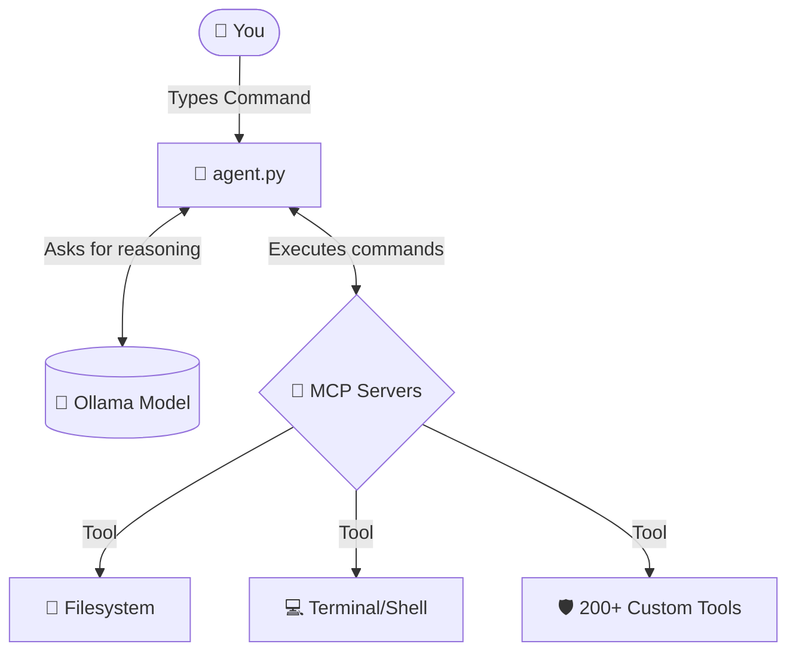

<div align="center">

# 🚀 Ollama MCP Orchestrator 
### Your Local, Private, Autonomous AI Agent

[](https://opensource.org/licenses/MIT)
[](https://www.python.org/downloads/)
[](https://ollama.com/)

</div>

---

## 🌟 What is this?
Imagine if ChatGPT or Claude had direct access to your computer's terminal, files, and professional software, but it ran **100% locally, offline, and privately** on your own hardware. That is exactly what this project does.

This Python orchestrator bridges **Ollama** (your local AI brain) with the **Model Context Protocol (MCP)** (your AI's hands). It automatically detects all your installed MCP tools and feeds them into the AI, allowing it to perform complex, multi-step tasks autonomously.

---

## 🏗️ How It Works (Architecture)



---

## 🌍 Cross-Platform Compatibility
This agent is built with standard Python, meaning you can run it almost anywhere:

*   🐧 **Linux (Kali, Ubuntu, Arch, etc.):** 100% Native support. Perfect for cybersecurity tools.
*   🍏 **macOS (M1/M2/M3 & Intel):** 100% Native support. Apple Silicon is *incredible* for running the large LLM brains.
*   🪟 **Windows:** Fully supported via Native Python or WSL2 (Windows Subsystem for Linux recommended for dev tools).
*   🍓 **Raspberry Pi:** Supported! However, you must use a "Nano" model (see Hardware Tiers below) due to RAM limitations.
*   ⚡ **Arduino / Microcontrollers:** While an Arduino cannot run the AI itself, this agent running on your PC *can* control your Arduino by using the Shell MCP to send serial commands to it!

---

## ⚙️ Hardware Requirements (Choose Your Tier)

Running an AI agent requires RAM. Choose the model that fits your machine:

### 🥇 The "Super-Agent" Tier (For High-End PCs & Macs)
*   **Who is this for?** Users wanting GPT-4/Claude 3.5 levels of autonomous coding and reasoning.
*   **Requirements:** 16GB+ RAM, and a Dedicated GPU (NVIDIA RTX 3060+ with 8GB+ VRAM) or an Apple Silicon Mac.
*   **Recommended Model:** `qwen2.5:7b`, `llama3.1:8b`, or `command-r`.

### 🥈 The "Minimal / Testing" Tier (For Old Laptops & Raspberry Pi)
*   **Who is this for?** Users on older Intel i3/i5 laptops, PCs with only 4GB-8GB of RAM, or Raspberry Pi 4/5. 
*   **Requirements:** 4GB RAM. No dedicated GPU needed.
*   **Recommended Model:** `qwen2.5:0.5b` or `qwen2.5:1.5b`. *(Note: The AI will not be exceptionally smart, but it will successfully demonstrate the tool-chaining architecture).*

---

## 🛠️ Step-by-Step Installation Guide

Follow these exact steps to get your autonomous agent running from scratch.

### Step 1: Install Ollama (The Brain)
You need Ollama to run the AI model locally.
*   **Mac/Windows:** Download the installer from [ollama.com](https://ollama.com).
*   **Linux/Raspberry Pi:** Run this command in your terminal:
    ```bash
    curl -fsSL https://ollama.com/install.sh | sh
    ```

### Step 2: Download Your AI Model
Open a terminal and tell Ollama to download a model. For this guide, we will use Qwen 2.5 (7 Billion parameters), which is excellent at using tools.
```bash
ollama pull qwen2.5:7b
```
*(If you are on a low-end PC or Raspberry Pi, type `ollama pull qwen2.5:0.5b` instead).*

### Step 3: Setup the Agent (This Repository)
Clone this repository to your machine and install the required Python libraries.

```bash
# 1. Clone the repository
git clone https://github.com/mr-vishal-singh01/Ollama-MCP-Orchestrator.git
cd Ollama-MCP-Orchestrator

# 2. Create a virtual environment (Recommended)
python3 -m venv venv

# 3. Activate the virtual environment
# On Linux/Mac:
source venv/bin/activate
# On Windows:
# .\venv\Scripts\activate

# 4. Install dependencies
pip install mcp openai
```

### Step 4: Configure Your Tools (MCP Servers)
The agent looks for a configuration file located at `~/.gemini/settings.json` (or wherever your MCP servers are configured). Ensure you have MCP servers installed (like `mcp-shell-server` or `mcp-server-filesystem`). 

*If your `settings.json` is located somewhere else (like Claude Desktop's config), open `agent.py` and change the `SETTINGS_PATH` variable on line 13 to point to your specific config file!*

### Step 5: Run the Agent!
Ensure Ollama is running in the background, then launch the agent:
```bash
python agent.py
```

---

## 🧠 Features & How to Use It

When you start the agent, it will automatically connect to every MCP server it finds. 

### 🛑 Safety First vs. ⚡ AUTO Mode
When booting up, you will be asked:
`Enable AUTO mode? (Skips (y/n) confirmation for tools - WARNING: Powerful but risky) [y/N]:`

*   **If you say NO (Default):** The agent will explain what it wants to do and ask for your permission `(y/n)` before executing *any* command on your computer. This is extremely safe.
*   **If you say YES (AUTO Mode):** The agent is given full autonomy. You can give it a massive prompt like *"Scan my local network for open ports, write a report about it, and save it to my desktop,"* and it will rapidly chain tools together on its own until the job is done.

### 🛡️ Context Protection
If the agent runs a tool that outputs a massive amount of text (like a heavy directory fuzzing scan), the `agent.py` script will automatically intelligently truncate the middle of the text. This prevents your local LLM from running out of memory (Context Window Overflow) and crashing!

---
*Created by Vishal Singh | Open Source for the Community*
